# Docker Compose Report

## Introduction

This report provides a comprehensive overview of the Docker Compose Quickstart tutorial, which introduces fundamental concepts of Docker Compose through the development of a basic Python web application. The application, built using the Flask framework, features a hit counter in Redis, demonstrating practical use cases of Docker Compose in web development scenarios.

---

## Step-by-Step Guide

### Step 1: Set Up

- **Project Directory Creation**: A directory named `composetest` is created.
- **Application Code**: A Python file `app.py` is created.

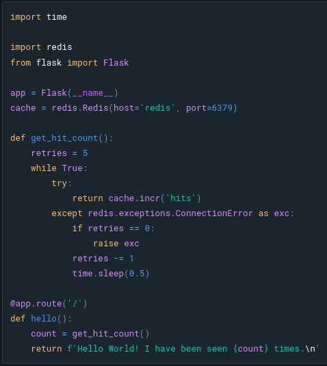

- **Dependencies**: A `requirements.txt` file lists necessary Python packages.
- **Dockerfile**: A `Dockerfile` is created to set up the Python environment, install dependencies, and run the Flask application.

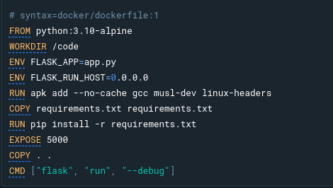

---

### Step 2: Define Services in a Compose File

- **Compose File Creation**: A `compose.yaml` file defines two services: `web` (Flask application) and `redis` (Redis database).

- **Service Configuration**: The `web` service builds from the local Dockerfile and maps port 8000 on the host to port 5000 on the container. The `redis` service uses an Alpine-based Redis image.

---

### Step 3: Build and Run Your App with Compose

- **Application Launch**: The command `docker compose up` builds and starts the defined services.

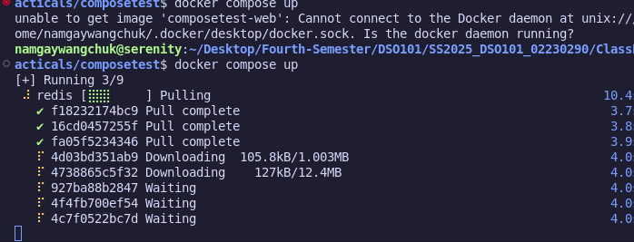  
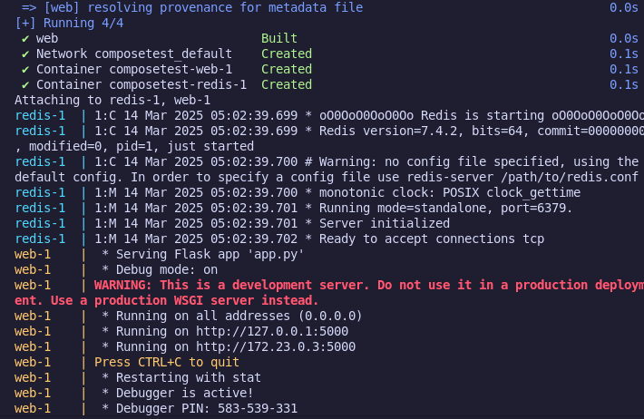

- **Verification**: Accessing `http://localhost:8000` in a web browser displays the application, with a hit counter incrementing on each refresh.

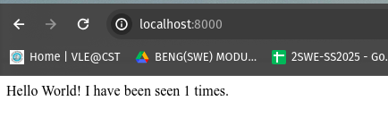  
  
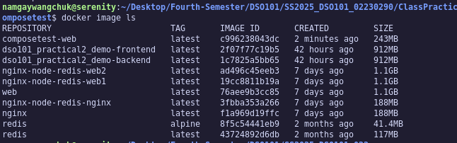  
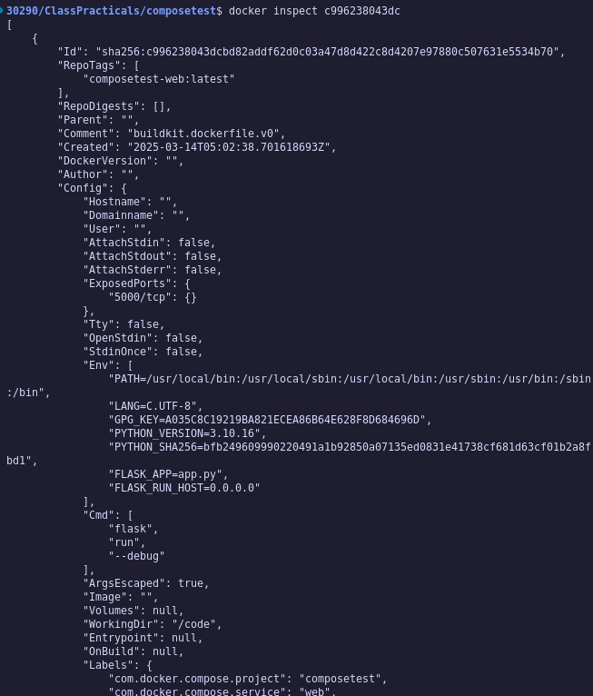

---

### Step 4: Edit the Compose File to Use Compose Watch

- **Compose Watch Integration**: The `compose.yaml` is modified to include `develop` and `watch` configurations, enabling automatic updates to the application upon code changes without restarting the container.

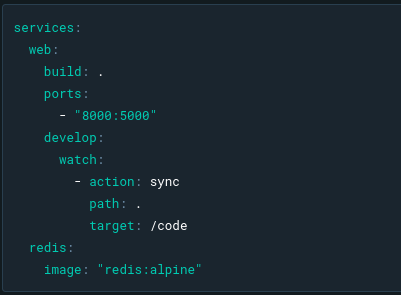

---

### Step 5: Re-build and Run the App with Compose

- **Watch Mode Activation**: Running `docker compose watch` initiates the application in watch mode, allowing real-time updates.

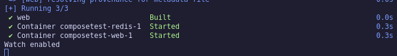

---

### Step 6: Update the Application

- **Code Modification**: Changing the greeting message in `app.py` and refreshing the browser demonstrates Compose Watch's functionality, as the updated message is displayed without manual restart.

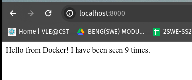

---

### Step 7: Split Up Your Services

- **Service Modularization**: The Redis service is moved to a separate `infra.yaml` file, and the `compose.yaml` file is updated to include this new configuration, showcasing how to modularize services for larger applications.

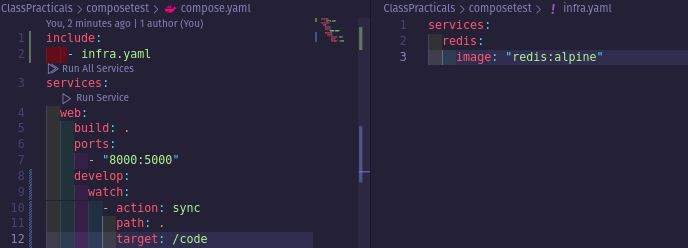

---

### Step 8: Experiment with Some Other Commands

- **Detached Mode**: Running services in the background using `docker compose up -d` and checking their status with `docker compose ps`.

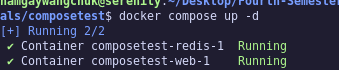  
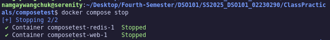

- **Service Management**: Commands like `docker compose stop` and `docker compose down` are used to stop and remove services, respectively.

---

## Conclusion

The Docker Compose Quickstart tutorial effectively demonstrates the power and simplicity of Docker Compose in managing multi-container Docker applications. By following the outlined steps, users can set up, configure, and manage a Flask application with a Redis backend, leveraging Docker Compose features like service definition, automatic updates with Compose Watch, and service modularization.

---
