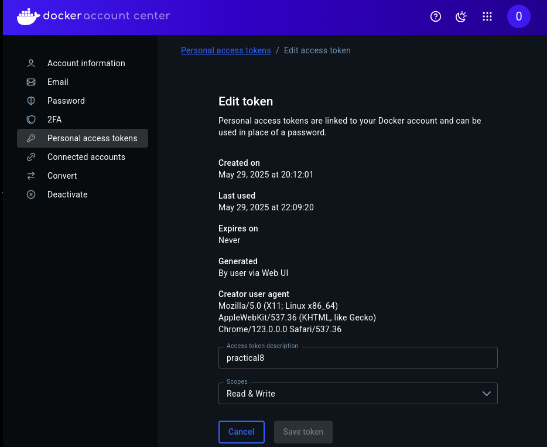
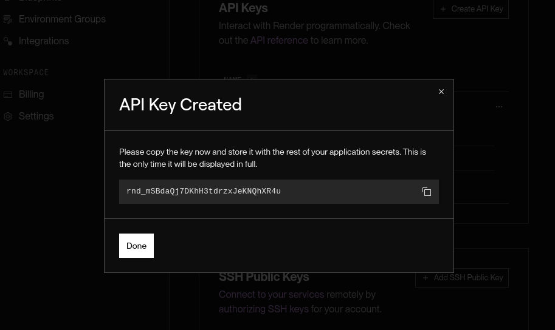
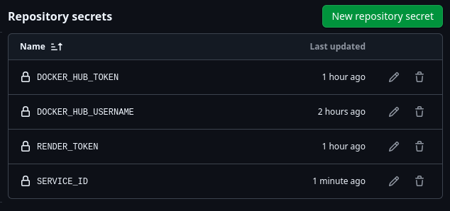
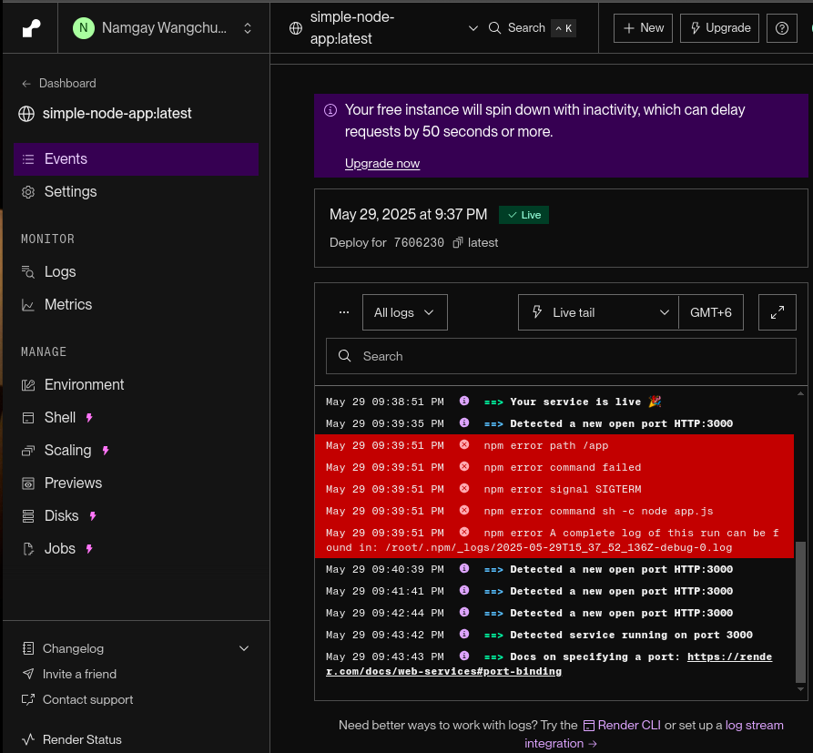
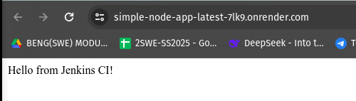
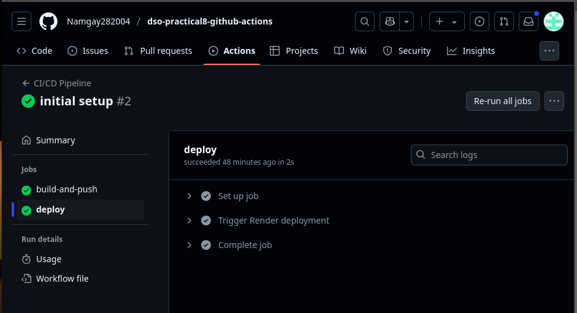
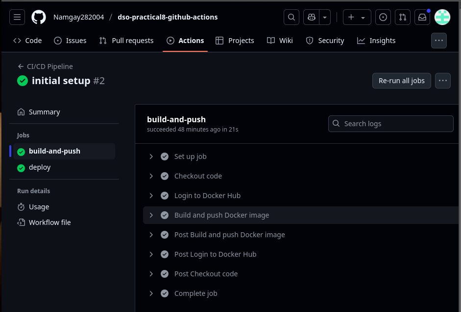
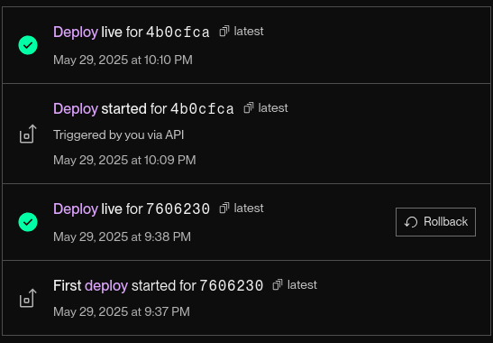

# Node.js CI/CD Pipeline with GitHub Actions, Docker Hub, and Render

This workthrough demonstrates a complete CI/CD workflow for a simple Node.js web application using GitHub Actions, Docker Hub, and Render.com.

## Project Setup

### Step 1: Set Up a Simple Node.js Project

1. Create a new directory and initialize a Node.js project:
   ```bash
   mkdir nodejs-ci-cd
   cd nodejs-ci-cd
   npm init -y
   ```

2. Install Express:
    ```
    npm install express
    ```

3. Create `app.js`:
    ```
    const express = require('express');
    const app = express();
    const PORT = process.env.PORT || 3000;

    app.use(express.static('public'));

    app.get('/', (req, res) => {
    res.sendFile(__dirname + '/public/index.html');
    });

    app.listen(PORT, () => {
    console.log(`Server running on port ${PORT}`);
    });
    ```

4. Create a `public`/ directory and add `index.html`:

    ```
    <!DOCTYPE html>
    <html>
    <head>
        <title>CI/CD Demo</title>
    </head>
    <body>
        <h1>Hello from CI/CD Pipeline!</h1>
        <p>This app is deployed automatically.</p>
    </body>
    </html>
    ```

### Step 2: Dockerize the Application

Create a `Dockerfile` in the project root:

```
# Use official Node.js image
FROM node:18-alpine

# Create app directory
WORKDIR /usr/src/app

# Copy package files
COPY package*.json ./

# Install dependencies
RUN npm install

# Copy app source
COPY . .

# Expose port
EXPOSE 3000

# Start the app
CMD ["node", "app.js"]
```

### Step 3: Initialize Git and Push to GitHub

1. Initialize Git and add `.gitignore`:
    ```
    git init
    echo "node_modules/" >> .gitignore
    echo ".env" >> .gitignore
    ```

2. Commit and push:
    ```
    git add .
    git commit -m "Initial commit"
    git remote add origin <your-github-repo-url>
    git push -u origin main
    ```

### Step 4: Set Up GitHub Actions Workflow

Create a GitHub Actions workflow file at `.github/workflows/ci-cd.yml`:

```
name: CI/CD Pipeline
on: [push]

jobs:
  build-and-deploy:
    runs-on: ubuntu-latest
    steps:
      - uses: actions/checkout@v3

      - name: Login to Docker Hub
        uses: docker/login-action@v2
        with:
          username: ${{ secrets.DOCKER_HUB_USERNAME }}
          password: ${{ secrets.DOCKER_HUB_TOKEN }}

      - name: Build and push Docker image
        uses: docker/build-push-action@v4
        with:
          context: .
          push: true
          tags: ${{ secrets.DOCKER_HUB_USERNAME }}/simple-node-app:latest

      - name: Trigger Render Deploy
        run: |
          curl -X POST \
            "https://api.render.com/v1/services/srv-d0s7ufjuibrs73b79rkg/deploys" \
            -H "Authorization: Bearer ${{ secrets.RENDER_TOKEN }}" \
            -H "Content-Type: application/json"
```

### Step 5: Set Up GitHub Secrets

Go to GitHub Repository > Settings > Secrets > Actions and add:

- `DOCKER_HUB_USERNAME` – your Docker Hub username

- `DOCKER_HUB_TOKEN` – Docker Hub access token (create under **Docker Hub** > **Account Settings** > **Security**)

  

- `RENDER_TOKEN` – Render API token (**Render Dashboard** > **Account Settings** > **API Keys**)

  

- `SERVICE_ID` - live application URL(`https://simple-node-app-latest-7lk9.onrender.com/`)

  

### Step 6: Set Up Render.com Deployment

1. Log in to Render.com

2. Click "**New**" > "**Web Service**"

3. Select "**Deploy an existing image from a registry**"

4. Fill in:

    - Name: nodejs-ci-cd-app

    - Image: your-dockerhub-username/nodejs-ci-cd-app:latest

    - Auto-deploy: Yes

    - Environment Variables: Add PORT=3000

    - Plan: Free

5. Click "Create Web Service"

    

    

### Step 7: Test the Pipeline

1. Make a small change in index.html

2. Commit and push:

    ```
    git add .
    git commit -m "Test CI/CD pipeline"
    git push origin main
    ```

3. Watch your workflow in **GitHub** > **Actions**

    

    

4. Check Docker Hub for the updated image

    

5. Verify your app is live at your Render.com URL

    


## Conclusion

This part of assignment successfully implemented an automated CI/CD pipeline for a Node.js application using GitHub Actions, Docker Hub, and Render.com, demonstrating modern DevOps practices in action.

The pipeline automatically builds Docker images on every code push, stores them in Docker Hub, and triggers deployments to Render, significantly reducing manual intervention while ensuring consistent deployments.
