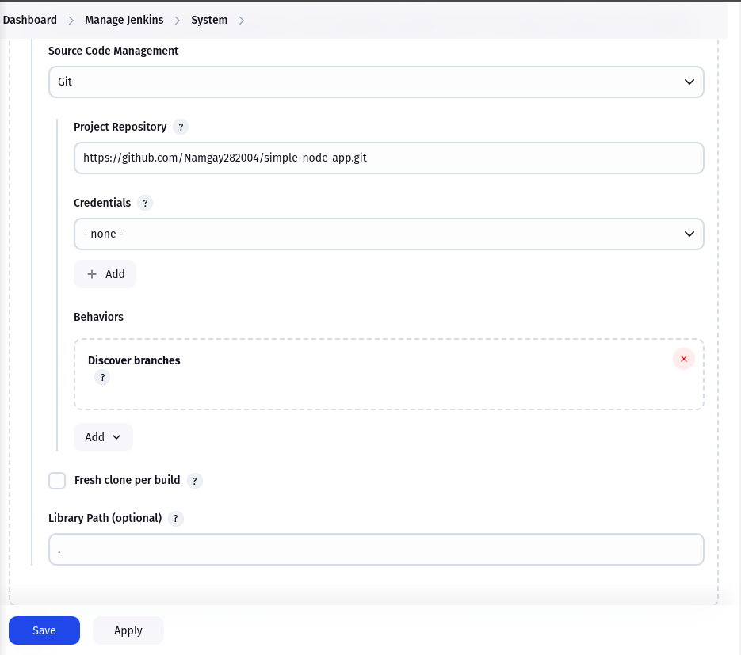
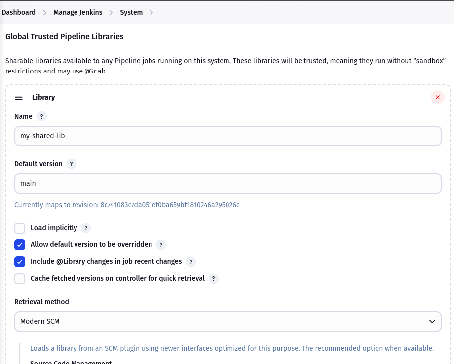
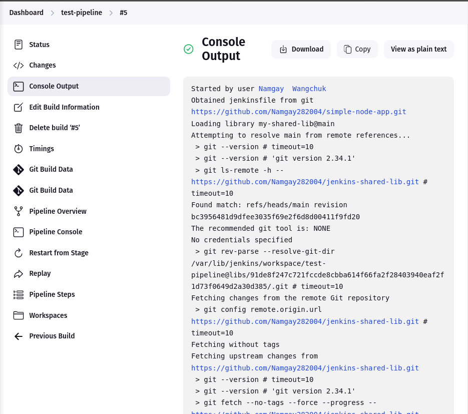
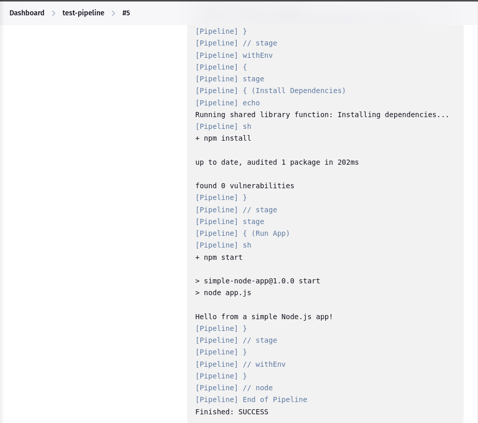

# Jenkins Shared Library Practical Report

## Objective

The goal of this practical was to configure and utilize a **Jenkins Shared Library** to execute common functionality across multiple pipelines. This exercise also involved setting up a simple Node.js application to test the shared functionality using Jenkins.

---

## Tools and Technologies Used

- Jenkins (v2.492.3)
- GitHub
- Node.js
- npm
- Declarative Jenkins Pipeline
- Jenkins Shared Libraries (`Global Trusted Pipeline Libraries`)

---

## Project Structure

### 1. **Node.js Application Repository**  
**Repository:** [`simple-node-app`](https://github.com/Namgay282004/simple-node-app)  
Contains:
- `app.js` (Basic Node.js app file)
- `package.json` with a start script
- `Jenkinsfile` to define the pipeline

### 2. **Shared Library Repository**  
**Repository:** [`jenkins-shared-lib`](https://github.com/Namgay282004/jenkins-shared-lib)  
Contains:
- `vars/installDependencies.groovy` – A custom shared function to install dependencies

---

## Steps Performed

### Step 1: Create Shared Library

- Created a GitHub repo `jenkins-shared-lib`
- Created a `vars/` directory
- Inside `vars/`, added a Groovy file `installDependencies.groovy`:

```groovy
def call() {
    echo 'Running shared library function: Installing dependencies...'
    sh 'npm install'
}
```

###  Step 2: Configure Shared Library in Jenkins

- If plugin **Shared Groovy Libraries** is not installed then install first.
    

- Navigated to: Manage Jenkins &rarr; Configure System

- Under Global Trusted Pipeline Libraries, added:

    - Name: my-shared-lib

    - Default version: main

   -  Retrieval Method: Modern SCM &rarr; Git &rarr; GitHub repo URL

    

    


### Step 3: Create and Configure Node.js App

- Initialized app using:
    ```
    npm init -y
    ```
- Updated package.json with:
    ```
    pts": {
    "start": "node app.js"
    }
    ```

- Created a basic app.js:
    ```
    console.log("App is running!");
    ```

### Step 4: Create Jenkinsfile
In the root of the Node.js project, created a Jenkinsfile with the following:

```
@Library('my-shared-lib') _  

pipeline {
    agent any
    stages {
        stage('Install Dependencies') {
            steps {
                demo() 
            }
        }
        stage('Run App') {
            steps {
                sh 'npm start'
            }
        }
    }
}
```

### Final Output
Upon executing the Jenkins job:

- The pipeline successfully cloned both the application and the shared library repositories.

- The shared library function executed **npm install**.

- Jenkins then ran the Node.js app using **npm start**, which triggered **node app.js**.

- Output was successfully printed: **App is running!**

    

    


### Conclusion
This practical successfully demonstrated:

- Setting up and using **Jenkins Shared Libraries**

- Separating reusable logic into a dedicated library repository

- Running a simple Node.js app using Jenkins Pipelines

Shared libraries help reduce code duplication and improve maintainability across Jenkins pipelines.

### Repository Links
[Simple Node App](https://github.com/Namgay282004/simple-node-app.git)

[Jenkins Shared Library](https://github.com/Namgay282004/jenkins-shared-lib.git)

