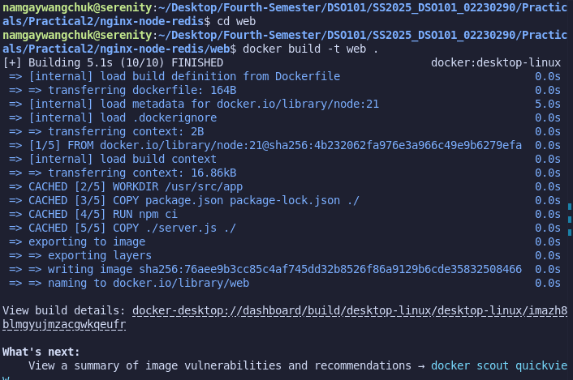
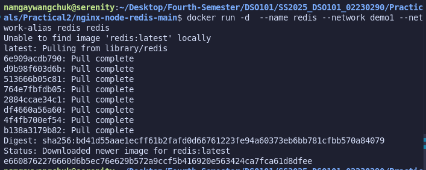
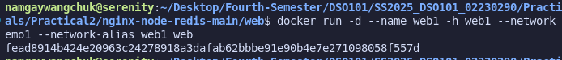
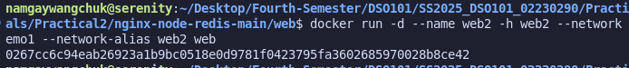
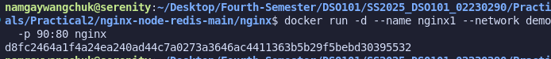
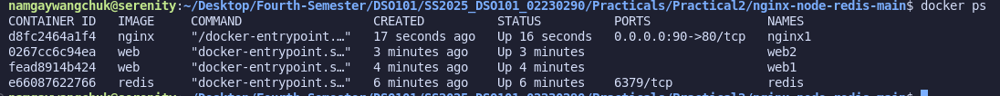
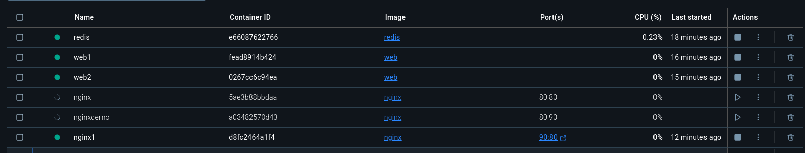
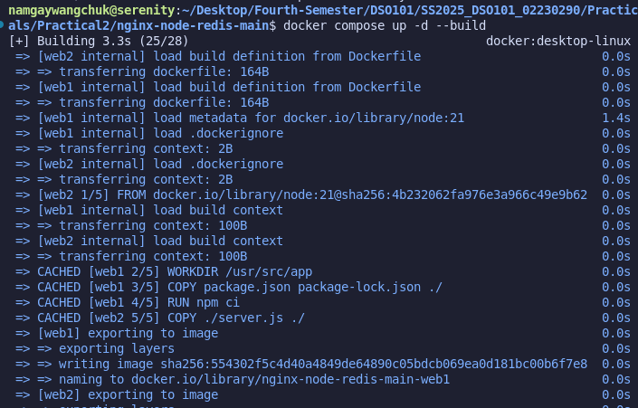
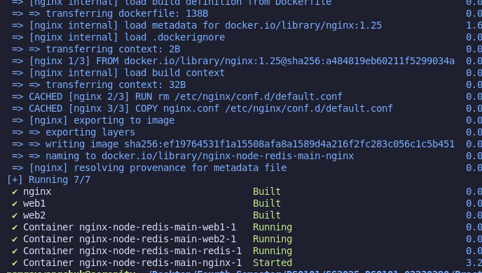
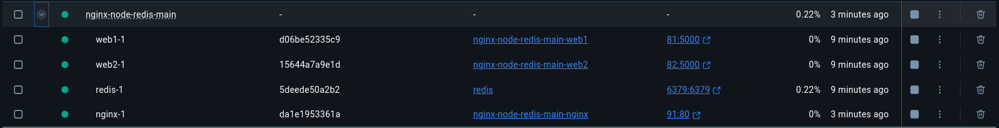

# Docker Networking and Container-to-Container

## Overview

This report covers how to create a Dockerfile inside an application directory, build a Docker image, and run a container. While running a single container is straightforward, managing multiple containers manually can be tedious. Docker Compose simplifies this process by allowing multiple containers to run together using a single configuration file.

## Steps Followed

### 1. Clone the Repository

```sh
git clone https://github.com/dockersamples/nginx-node-redis
```

### 2. Navigate into the Directory

```sh
cd nginx-node-redis-main
```
### 3. Build the Images

Build the Nginx image:

```sh
cd nginx
docker build -t nginx .
```


Build the Web application image:

```sh
cd ../web
docker build -t web .
```



### 4. Create a Network for Communication

```sh
docker network create demo1
```


### 5. Run the Containers

Run Redis container:
```sh
docker run -d --name redis --network demo1 --network-alias redis redis
```



Run Web containers:
```sh
docker run -d --name web1 -h web1 --network demo1 --network-alias web1 web
```


```sh
docker run -d --name web2 -h web2 --network demo1 --network-alias web2 web
```


Run Nginx container:
```sh
docker run -d --name nginx1 --network demo1 -p 90:80 nginx
```



### 6. Verify Running Containers

```sh
docker ps
```


You can also check the running containers on the Docker Desktop Dashboard.



## Simplifying Deployment with Docker Compose

Instead of running multiple docker run commands, Docker Compose allows you to define all containers in a compose.yml file and deploy them together.

### Steps to Use Docker Compose

1. Navigate to the project’s root directory where the compose.yml file is located.
2. Run the following command to build and start all containers:
```sh
docker compose up -d --build
```





3. Check the Docker Desktop Dashboard to verify the running containers.



## Conclusion

Using Docker Compose makes managing multiple containers easier and more efficient. Instead of manually running each container, a single command can start and configure them all. This approach simplifies deployment and improves workflow efficiency.