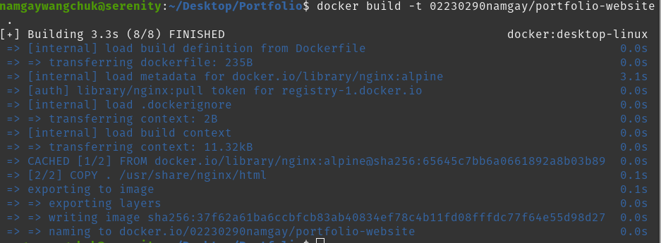
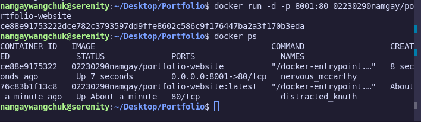
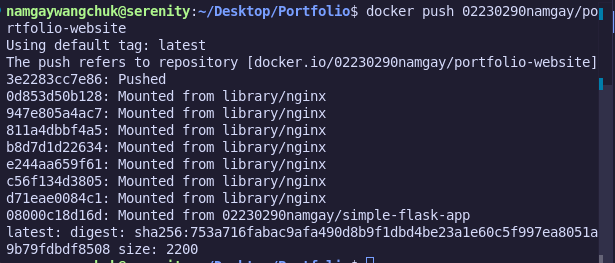
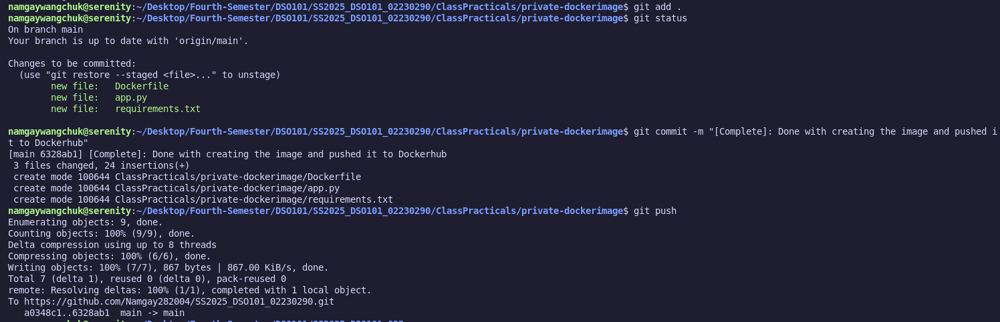
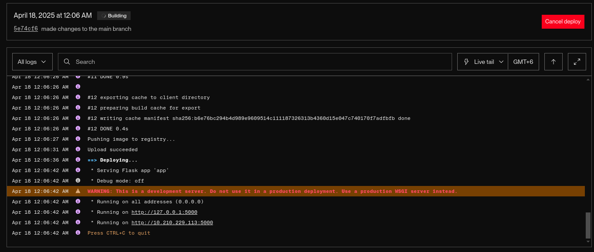
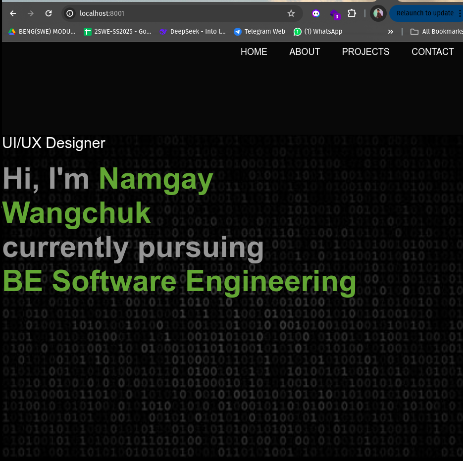

# Docker Practical Report

## Part 1: Create and Push a Pre-built Docker Image

### Step 1: Prepare the Application

For this practical, I used my personal portfolio website consisting of:
- `index.html`
- `style.css`
- Various images and assets

### Step 2: Create a Dockerfile

```Dockerfile
# Use official Nginx base image
FROM nginx:alpine

# Copy portfolio files into the default Nginx public directory
COPY . /usr/share/nginx/html

# Expose port 80
EXPOSE 80
```

###  Step 3: Build the Docker Image

```
docker build -t 02230290namgay/portfolio-website .
```


### Step 4: Test the Docker Image Locally

```
docker run -d -p 8001:80 02230290namgay/portfolio-website
```


###  Step 5: Push Image to Docker Hub

```
docker login
docker push 02230290namgay/portfolio-website
```


## Part 2: Dockerfile + GitHub + Render Deployment

### Step 1: GitHub Setup
- The same application was committed and pushed to a public GitHub repository.


- The Dockerfile was placed in the root directory.

### Step 2: Deploy to Render
- Created a new web service on Render.com

- Selected Docker as deployment method

- Connected to GitHub repo

- Set the Dockerfile path as Dockerfile

- Render automatically built and deployed the container


    Successful deployment to Render. We can now view the image locally using the port ```localhost:8001```
    

## Conclusion

This Docker practical exercise provided hands-on experience in containerizing a web application and deploying it using different platforms. By creating a Dockerfile for a simple portfolio website and building a Docker image, I learned the fundamental steps of containerization. Testing the image locally ensured that the application worked as expected before pushing it to Docker Hub for public access.

The second part of the practical demonstrated the integration of Docker with GitHub and Render.com. By connecting a GitHub repository containing the Dockerfile to Render, the deployment process became automated. 
