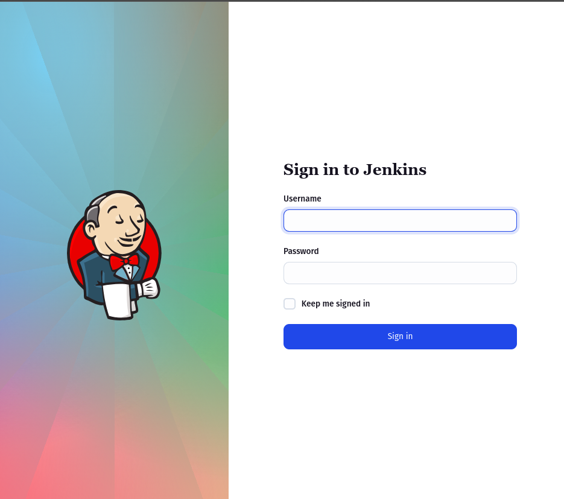
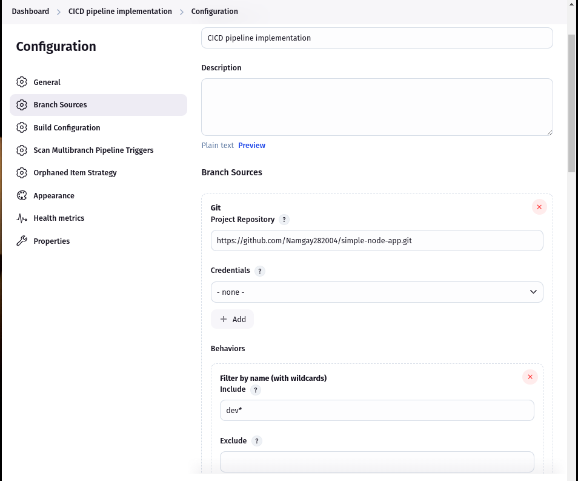
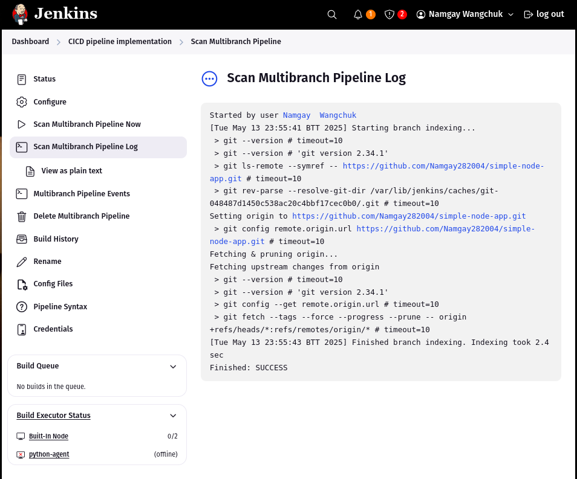
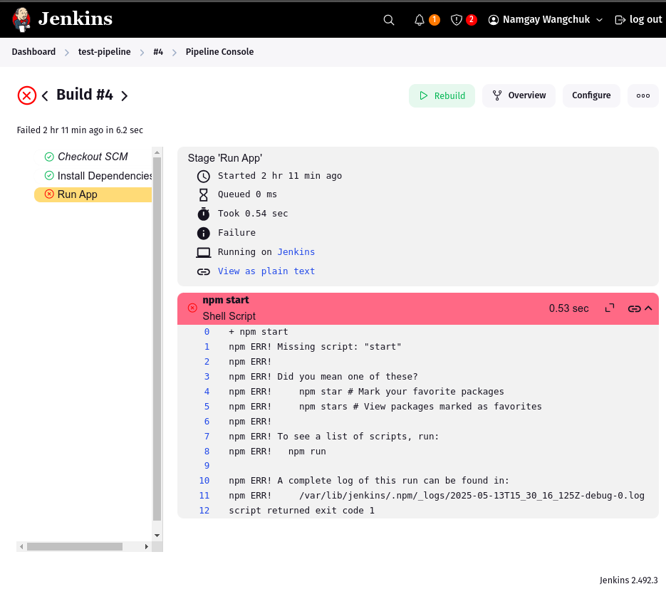

# Jenkins CI/CD Practical Report

## What is Jenkins?

**Jenkins** is an open-source automation server used to automate the building, testing, and deployment of software. It is commonly used to implement continuous integration and continuous delivery (CI/CD) pipelines.

Jenkins helps you automate:
- **Builds**
- **Tests**
- **Monitoring**, triggered by events like Git commits or pull requests

---

## Objective

To set up a Jenkins server locally and configure a multibranch pipeline that selectively builds only the `dev` branch from a GitHub repository and runs a development environment via a `Jenkinsfile`.

---

## Tasks Completed

### 1. Jenkins Environment Setup
- Installed Jenkins and launched it on `localhost:8080`
- Installed necessary plugins: Git, Pipeline, Multibranch Pipeline
- Created an admin account and configured basic settings

    

### 2. GitHub Repository Setup
- Created a sample Node.js app repository: `simple-node-app`
- Added two branches: `main` and `dev`
- Added a `Jenkinsfile` in the `dev` branch with build and run instructions

### 3. Multibranch Pipeline Job Creation
- Created a **Multibranch Pipeline** in Jenkins
- Configured the GitHub repo as the source
- Set branch filtering to build only the `dev` branch

    

### 4. Jenkinsfile Content (in `dev` branch)

```groovy
pipeline {
    agent any

    stages {
        stage('Install Dependencies') {
            steps {
                echo 'Installing dependencies...'
                sh 'npm install'
            }
        }

        stage('Run App') {
            steps {
                echo 'Running app in dev environment...'
                sh 'npm start'
            }
        }
    }
}
```

### 5. Pipeline Execution
- Jenkins automatically detected branches

- Only the **dev** branch was built

- Dependencies were installed successfully

    

- Application failed to start due to missing **start** script (correctable by adding to **package.json**)
    

### Outcome
Successfully set up a multibranch Jenkins pipeline that:

- Builds only the **dev** branch

- Executes tasks defined in a **Jenkinsfile**

Identified and debugged build issues such as:

- Missing **package.json**

- Missing **start** script in **package.json**

    

### Conclusion
This practical provided hands-on experience with:

- Jenkins installation and job configuration

- GitHub integration with multibranch pipelines

- Creating and using a **Jenkinsfile** for CI/CD tasks

- Automating build and run processes for a development environment

This setup forms the foundation for automating deployments in real-world software projects.


