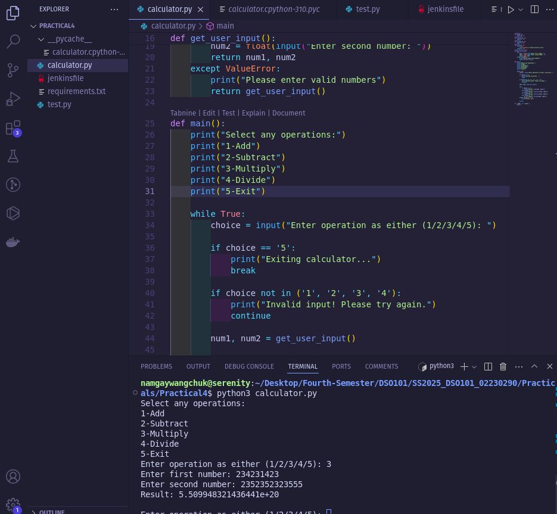
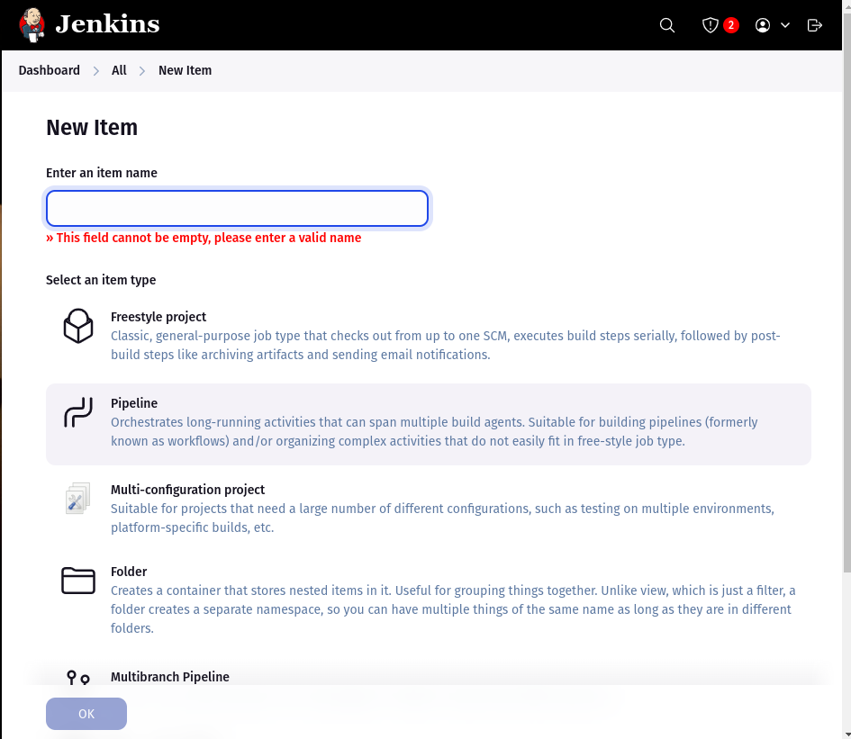
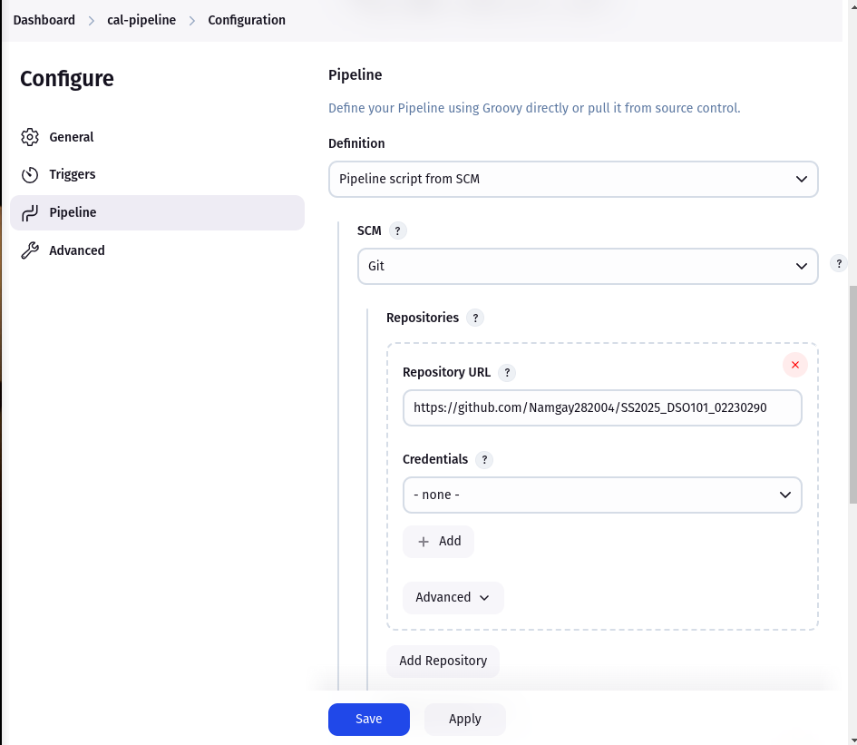
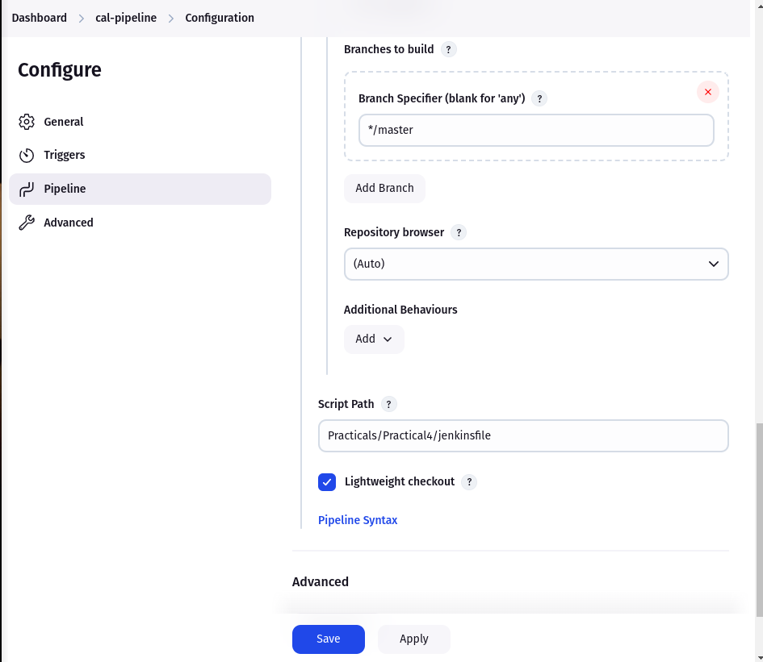
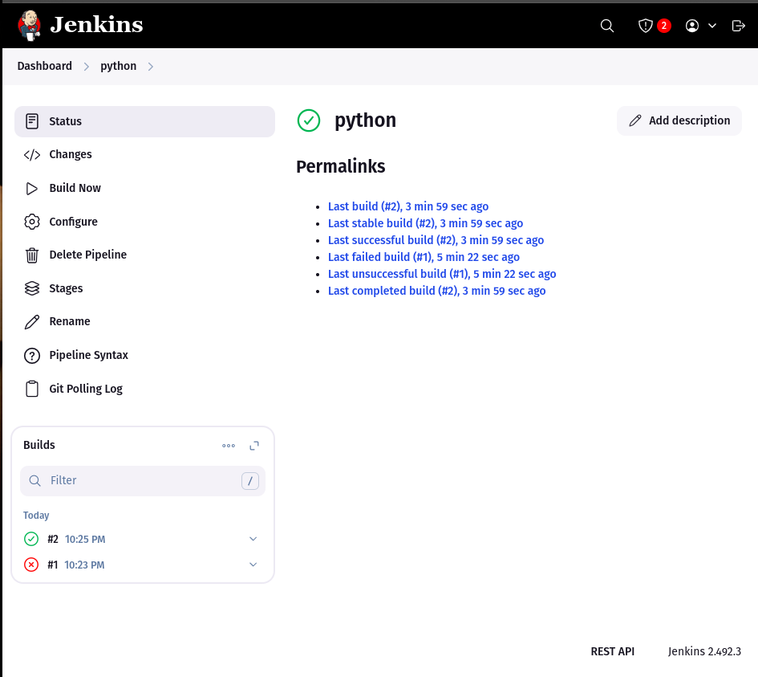
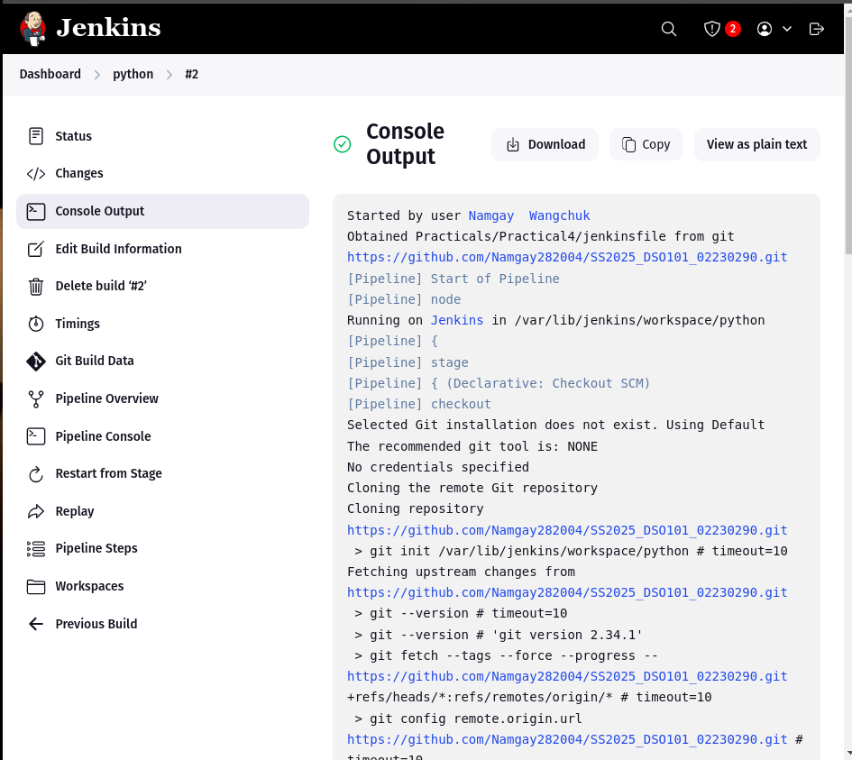
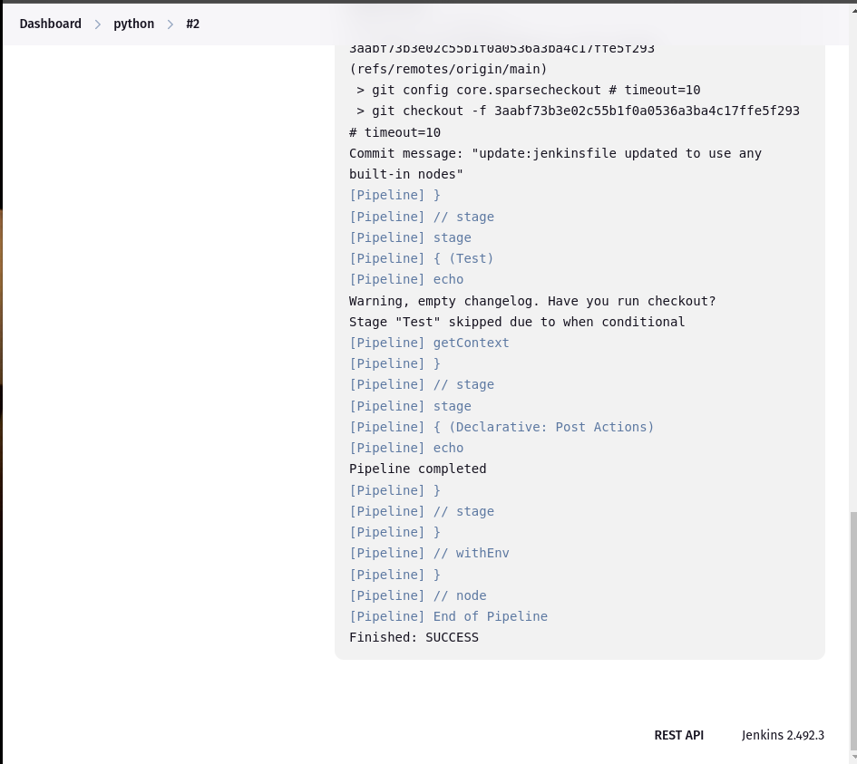
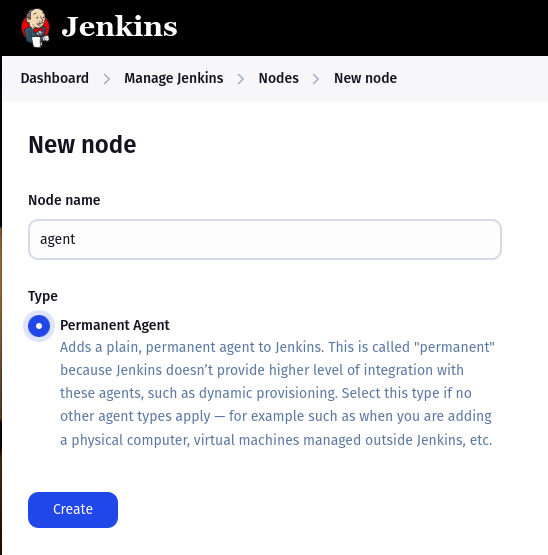
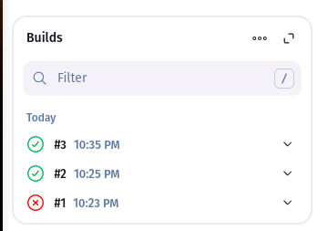
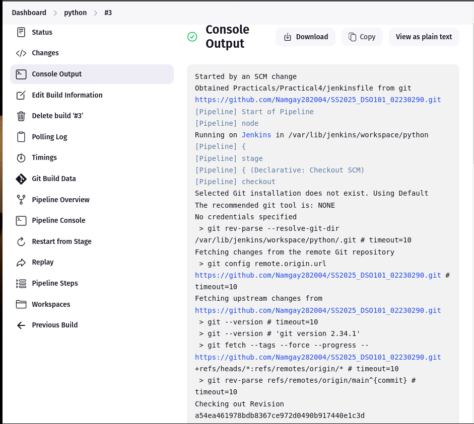

# Python Calculator CI/CD Pipeline Implementation

## Overview
This document outlines the implementation of a Jenkins CI/CD pipeline for automated testing of a Python calculator application. The solution features commit-message triggered test execution, providing an efficient testing workflow that conserves resources while maintaining development agility.

**Before creating the Jenkins pipeline, you'll need a Python application with test cases.**

In this implementation, I've developed a calculator application that:

✔ Accepts two input values

✔ Performs four core operations:

-   Addition

-   Subtraction

-   Multiplication

-   Division

Sample output for the simple python-calculator application



✔ Includes comprehensive test cases in a separate `test.py` file

✔ Is hosted on GitHub for CI/CD integration


## How to Create a Jenkins Pipeline

**Prerequisites:** To use Jenkins Pipeline, you will need:
- Jenkins 2.x or later

- The Pipeline plugin (which may be installed by default)

In this documentation, we will create the pipelines using the classic UI.

### Install Required Plugins:
- Git plugin
- Pipeline plugin
- GitHub plugin (optional)

### Set Up a New Pipeline Job

1. Log into Jenkins.

2. In the Dashboard, select **New Item**.

3. Type an item name and select **Pipeline** from the list of item types. Click **OK**.

    

4. In the Pipeline configuration page, click the **Pipeline** tab. Under **Definition**, select the option **Pipeline script from SCM**.

5. Under **SCM**, select the **Git** option. Enter your Repository URL.


6. Specify the branch (master/main).


7. Set the script path (default: Jenkinsfile) and click **Save**. The Pipeline project/item view page appears. Click **Build Now**.

    

Jenkins Pipeline created successfully





That's it! You've launched a pipeline using the pipeline script you provided. You can now:
- Access pipeline details by clicking **Build History** and selecting the pipeline

- View full output from the pipeline run by clicking **Console Output**

### Configure an Agent Node:
1. Go to **Jenkins → Manage Jenkins → Nodes**

2. Create a new node with label "agent"

3. Select **Permanent Agent**


4. Configure:
   - Number of executors: 1
   - Remote root directory: `/home/jenkins/agent` (or any preferred path)
   - Labels: `agent`
   - Usage: **Use this node as much as possible**
   - Launch method: **Launch agent via Java Web Start** (or SSH if preferred)
   

**Note:** If the agent remains offline after setup, modify your Jenkinsfile to use the built-in node:

```groovy
pipeline {
    agent any  // Instead of specifying 'agent' label
}
```

## How It Works
When you commit with a message containing "@test" (e.g., "Fixed bug @test"), Jenkins will:

- Detect the commit message

- Run the pipeline on an agent node

- Execute the pytest tests


The commit message `@test` was triggered by the pipeline and it is later automated by the specified agent.



For commit messages without "@test", the tests will not run.


## Conclusion

This Jenkins pipeline automates testing for the Python calculator, running pytest only when commits contain `@test`. The setup ensures efficient testing while keeping the workflow simple and resource-friendly.